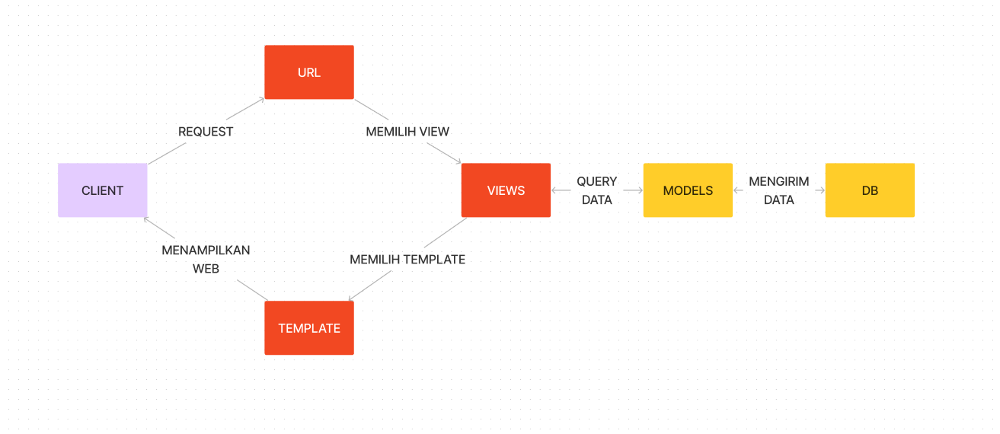
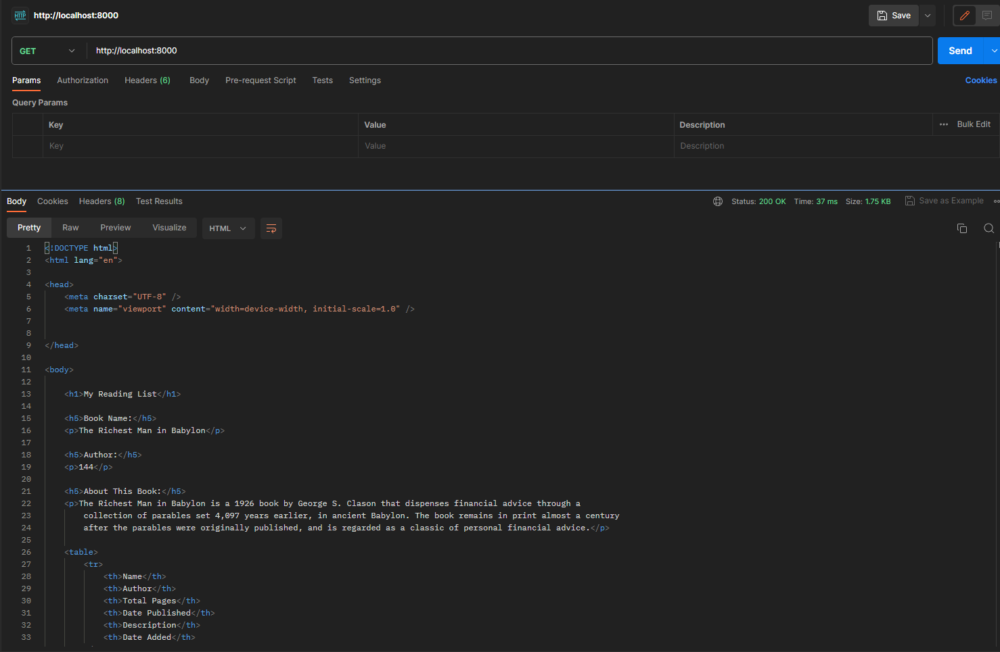
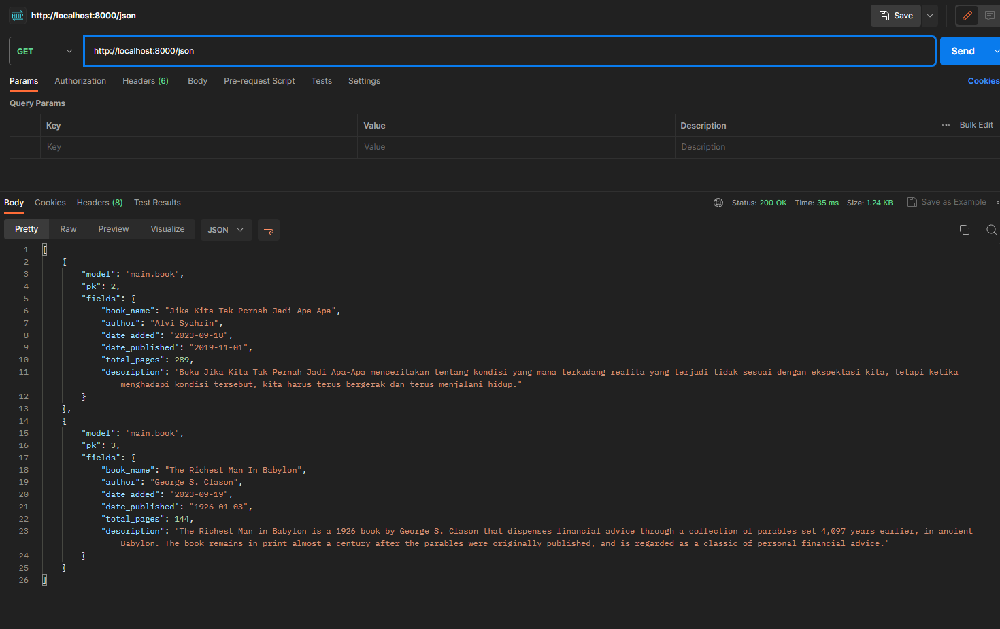
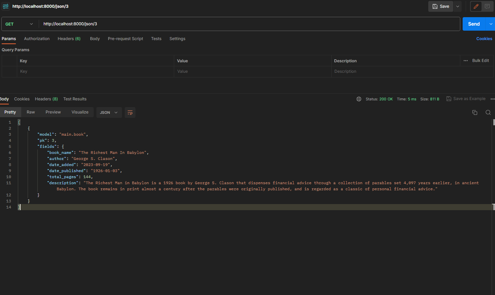
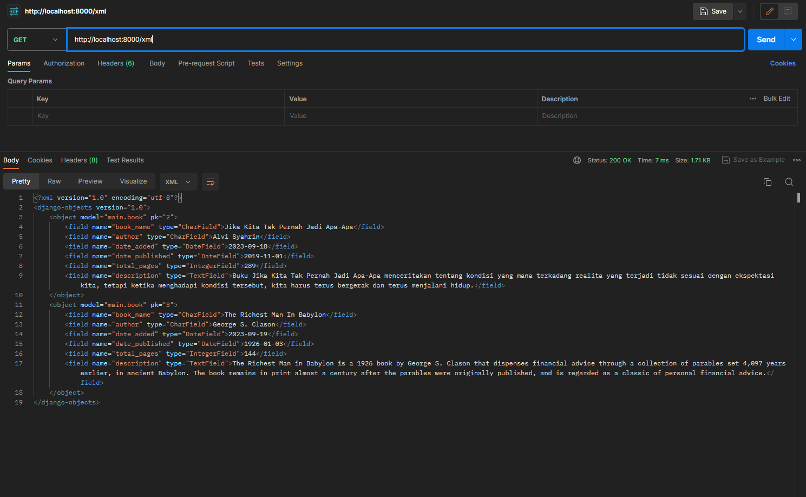
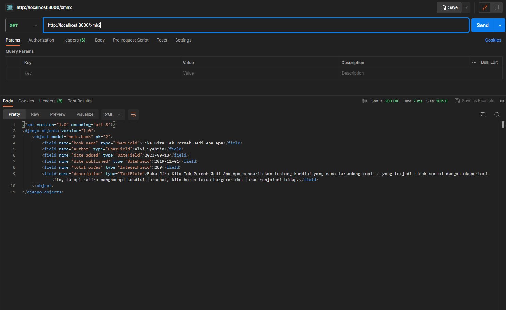

# TUGAS 2

1. Jelaskan bagaimana cara kamu mengimplementasikan checklist di atas secara step-by-step (bukan hanya sekadar mengikuti tutorial).

   - Membuat direktori dengan nama reading-list. Nama bisa disesuaikan dengan nama project yang ingin dibuat.
   - Membuat virtual environment pada direktori tersebut.
   - Mendownload dependencies yang dibutuhkan dalam pembuatan project.
   - Membuat proyek Django dengan nama reading_list. Dengan menuliskan
     `   django-admin startproject reading_list .`
     pada terminal
   - Membuat aplikasi baru pada proyek dengan menjalankan `python manage.py startapp main` pada terminal
   - Mendaftarkan aplikasi yang sudah dibuat ke dalam proyek. Dengan cara memasukkan `main` pada variable `INSTALLED_APPS` yang terdapat pada file settings.py di direktori proyek.
   - Membuat direktori baru pada main dengan nama templates dan membuat file html di dalamnya.
   - Membuat kode html sesuai dengan yang diinginkan
   - Mengubah file `models.py` dan mengisinya dengan class model yang diinginkan

   ```
    from django.db import models

    class Book(models.Model):
        book_name = models.CharField(max_length=255)
        author = models.CharField(max_length=255)
        date_added = models.DateField(auto_now_add=True)
        total_pages = models.IntegerField()
        description = models.TextField()
   ```

   - melakukan migrasi agar data sesuai dengan model yang dibuat.
   - menghubungkan komponen view dan template dengan mengubah isi file `views.py` pada direktori `main`.
   - mengimpor render dari django.shortcuts

   ```
    from django.shortcuts import render
   ```

   - Menambahkan fungsi `show_main` dan isi objek `context` dengan data yang diinginkan

   ```
   def show_main(request):
    context = {
        context = {
        'book_name': 'The Richest Man in Babylon',
        'author': 'George S. Clason',
        'total_pages': 144,
        'description': 'The Richest Man in Babylon is a 1926 book by George S. Clason that dispenses financial advice through a collection of parables set 4,097 years earlier, in ancient Babylon. The book remains in print almost a century after the parables were originally published, and is regarded as a classic of personal financial advice.'
        }
    }

    return render(request, "main.html", context)
   ```

   - Mengonfigurasikan URL pada aplikasi `main`
   - Buat file `urls.py` pada `main` dan isi dengan kode berikut

   ```
    from django.urls import path
    from main.views import show_main

    app_name = 'main'

    urlpatterns = [
        path('', show_main, name='show_main'),
    ]
   ```

   - Setelah itu mengonfigurasikan URL pada proyek dengan mengimpor fungsi include dari django.urls pada file `urls.py` di direktori proyek
   - Menambahkan URL agar menampilkan main pada variabel `urlpatterns`.

2. Buatlah bagan yang berisi request client ke web aplikasi berbasis Django beserta responnya dan jelaskan pada bagan tersebut kaitan antara urls.py, views.py, models.py, dan berkas html.
   

   - Pada bagan tersebut terdapat client, url, model, dan juga template. Lalu apa kaitan antara file-file urls.py, views.py, models.py, dan berkas html?
   - File urls.py bertugas untuk routing url, atau dalam kata lain mengatur alur dari request dan response web agar melalui link sesuai dengan request client.
   - Lalu views.py merupakan file yang bertugas untuk mengatur dan mengolah data yang akan ditampilkan kepada client
   - Ada pula models.py yang merupakan file untuk sebagai penghubung antara proyek dan juga database.
   - dan terakhir ada berkas-berkas html yang merupakan file dalam web yang ditampilkan kepada client/user

3. Jelaskan mengapa kita menggunakan virtual environment? Apakah kita tetap dapat membuat aplikasi web berbasis Django tanpa menggunakan virtual environment?
   Virtual environment berfungsi untuk mengisolasi projek yang sedang dikerjakan dari system global, sehingga hal-hal yang dilakukan seperti mendownload dependencies tidak menggangu proyek python lainnya. Sebetulnya bisa saja membuat aplikasi web Django tanpa menggunakan virtual environment tetapi jika ada proyek django lainnya maka jika terdapat perubahan bisa saja proyek lain tersebut ikut terkena imbas dari perubahan tersebut.

4. Jelaskan apakah itu MVC, MVT, MVVM dan perbedaan dari ketiganya.
   - MVC merupakan singkatan dari Model-View-Controller. Pada pola pemrograman ini kode dibagi menjadi 3 komponen yaitu model yang berfungsi untuk berkomunikasi dengan database dan mengatur logic dibalik layar dari program. Lalu ada view yang berisikan file-file yang akan dilihat oleh user, dan ada controller yang menghubungkan antara model dan juga view
   - MVT merupakan singkatan dari Model-View-Template. MVT ini memiliki beberapa kesamaan dengan MVC, namun pada MVT views bisa melakukan HTTP response dan request. Template pada MVT juga berisi file-file html yang akan ditampilkan kepada user.
   - MVVM adalah singkatan dari Model-View-ViewModel. Pada pemrograman ini model dan viewmodel bertugas untuk mengambil dan menyimpan data, dan view bertugas menampilkan data-data tersebut kepada user. Viewmodel juga berfungsi sebagai penghubung antara view dan model.

# TUGAS 3

1. Apa perbedaan antara form POST dan GET dalam Django?
   - form POST digunakan untuk melakukan sesuatu yang mengubah keadaan dalam server/aplikasi, sedangkan jika GET digunakan tidak akan mengubah sesuatu dalam server/aplikasi
2. Apa perbedaan utama antara XML, JSON, dan HTML dalam konteks pengiriman data?
   - HTML merupakan singkatan dari HyperText Markup Language yang digunakan untuk menuliskan struktur dari sebuah web. HTML berbentuk tag-tag yang berisi tipe konten dan mengirimkan isi konten.
   - XML adalah singkatan dari eXtensible Markup Language. Tag-tag yang terdapat pada XML bisa menggunakan nama yang mendeskripsikan data yang terdapat di dalam tag tersebut.
   - JSON adalah singkatan dari JavaScript Object Notation format untuk pertukaran data yang ringan. Walaupun dalam namanya terdapat kata JavaScript tetapi format file json tidak bergantung terhadap bahasa pemrograman apapun, tetapi menggunakan bentuk objek dari JavaSript.
3. Mengapa JSON sering digunakan dalam pertukaran data antara aplikasi web modern?

- JSON lebih mudah untuk digunakan dalam menuliskan data yang berukuran kecil. JSON juga lebih efisien untuk digunakan dalam membuat API. Ukuran file JSON relatif lebih kecil dibandingkan dengan file XML.

4. Jelaskan bagaimana cara kamu mengimplementasikan checklist di atas secara step-by-step (bukan hanya sekadar mengikuti tutorial).

   - membuat form untuk menginput data dengan membuat file `forms.py` dan membuat struktur form di file tersebut

   ```
   from django.forms import ModelForm
   from main.models import Book

   class ProductForm(ModelForm):
      class Meta:
         model = Book
         fields = ["book_name", "author", "total_pages", "date_published", "description"]
   ```

   - menambahkan beberapa import pada file `views.py` pada folder `main` lalu membuat fungsi baru dengan nama `create_product` seperti berikut

   ```
      def create_product(request):
         form = ProductForm(request.POST or None)

         if form.is_valid() and request.method == "POST":
            form.save()
            return HttpResponseRedirect(reverse('main:show_main'))

         context = {'form': form}
         return render(request, "create_product.html", context)
   ```

   - mengganti isi fungsi `show_main` menjadi seperti berikut

   ```
      def show_main(request):
      products = Book.objects.all()

      context = {
         'book_name': 'The Richest Man in Babylon',
         'author': 'George S. Clason',
         'total_pages': 144,
         'description': 'The Richest Man in Babylon is a 1926 book by George S. Clason that dispenses financial advice through a collection of parables set 4,097 years earlier, in ancient Babylon. The book remains in print almost a century after the parables were originally published, and is regarded as a classic of personal financial advice.',
         'products': products,
      }

      return render(request, "main.html", context)
   ```

   - menambah import fungsi `create_product` pada file `urls.py` di folder `main`

   ```
   from main.views import show_main, create_product
   ```

   - menambahkan path url baru ke dalam `urlpatterns` di file `urls.py`

   - membuat file html baru bernama `create_product.html` di folder `main/templates` dan mengisinya dengan kode yang membuat form method post

   ```
   

   
   <h1>Add New Product</h1>

   <form method="POST">
      
      <table>
         {{ form.as_table }}
         <tr>
               <td></td>
               <td>
                  <input type="submit" value="Add Product"/>
               </td>
         </tr>
      </table>
   </form>

   
   ```

   - menambah kode berikut ini ke main.html di dalam ``

   ```
   <table>
    <tr>
        <th>Name</th>
        <th>Author</th>
        <th>Total Pages</th>
        <th>Date Published</th>
        <th>Description</th>
        <th>Date Added</th>
    </tr>

     Berikut cara memperlihatkan data produk di bawah baris ini 

    
        <tr>
            <td>{{product.name}}</td>
            <td>{{product.author}}</td>
            <td>{{product.total_pages}}</td>
            <td>{{product.date_published}}</td>
            <td>{{product.description}}</td>
            <td>{{product.date_added}}</td>
        </tr>
    
   </table>

   <br />

   <a href="">
      <button>
         Add New Product
      </button>
   </a>
   ```

   - Menampilkan data dalam bentuk JSON dan XML dengan mengubah isi file `views.py`
   - Menambahkan import `HttpResponse` dari `django.http` dan `serializers` dari `django.core`
   - Membuat fungsi baru dengan parameter request dengan nama `show_xml`, `show_json`, `show_xml_by_id` dan `show_json_by_id`. Lalu membuat variabel di dalam fungsi yang menyimpan query data pada Book. Lalu mereturn data di dalam variabel yang sudah dilakukan method `serialize`

   ```
   def show_xml(request):
    data = Book.objects.all()
    return HttpResponse(serializers.serialize("xml", data), content_type="application/xml")
   ```

   ```
   def show_json(request):
    data = Book.objects.all()
    return HttpResponse(serializers.serialize("json", data), content_type="application/json")
   ```

   ```
   def show_xml_by_id(request, id):
    data = Book.objects.filter(pk=id)
    return HttpResponse(serializers.serialize("xml", data), content_type="application/xml")
   ```

   ```
   def show_json_by_id(request, id):
    data = Book.objects.filter(pk=id)
    return HttpResponse(serializers.serialize("json", data), content_type="application/json")
   ```

   - Method show_xml_by_id dan show_json_by_id meng-query data pada book sesuai dengan id yang dimasukkan ke dalam parameter url

   - mengimpor fungsi yang sudah dibuat ke file `urls.py` pada folder `main`

   ```
   from main.views import show_main, create_product, show_xml, show_json, show_json_by_id, show_xml_by_id
   ```

   - menambahkan path url ke dalam `urlpatterns` sesuai dengan fungsi yang sudah dibuat

   ```
   path('xml', show_xml, name='show_xml'),
    path('json', show_json, name='show_json'),
    path('xml/<int:id>', show_xml_by_id, name='show_xml_by_id'),
    path('json/<int:id>', show_json_by_id, name='show_json_by_id')
   ```

### Screenshot response url dari postman

- Main page di postman
  

- Response JSON dari postman
  

- Response JSON sesuai ID dari postman
  

- Response XML dari postman
  

- Response XML sesuai ID dari postman
  

# TUGAS 4

1. Apa itu Django UserCreationForm, dan jelaskan apa kelebihan dan kekurangannya?
   - Django UserCreationForm adalah fitur built-in django yang berfungsi untuk membuat sebuah form yang digunakan untuk membuat pengguna baru di Django. Form ini merupakan subclass dari ModelForm dan menggunakan model User sebagai model datanya. Form ini juga telah menerapkan validasi untuk memastikan bahwa username dan password yang dimasukkan valid.
   - Kelebihan UserCreationForm, yaitu:
     - Mudah digunakan: Form ini memiliki tiga field yang sederhana dan mudah dipahami.
     - Validasi: Form ini telah menerapkan validasi untuk memastikan bahwa username dan password yang dimasukkan valid.
       -Kekurangan UserCreationForm, yaitu:
     - Tidak dapat menambahkan field tambahan: Form ini tidak dapat menambahkan field tambahan selain username, password1, dan password2.
     - Tidak dapat mengubah model User: Form ini tidak dapat mengubah model User yang digunakan.
2. Apa perbedaan antara autentikasi dan otorisasi dalam konteks Django, dan mengapa keduanya penting?
   - Autentikasi dan otorisasi adalah dua konsep yang penting dalam keamanan web. Autentikasi adalah proses mengidentifikasi pengguna, sedangkan otorisasi adalah proses menentukan apakah pengguna memiliki izin untuk mengakses sumber daya tertentu.
   - Dalam django, autentikasi dilakukan dengan model `User`. Model ini menyimpan informasi tentang pengguna, seperti username, password, dan email. Autentikasi dilakukan dengan membandingkan username dan password yang dimasukkan pengguna dengan informasi yang disimpan di model User.
   - Otorisasi dilakukan dengan menggunakan sistem izin. Sistem ini menentukan apakah pengguna memiliki izin untuk mengakses sumber daya tertentu.
   - Kedua konsep ini penting karena keduanya membantu melindungi aplikasi dari pengguna yang tidak sah. Autentikasi membantu memastikan bahwa hanya pengguna yang sah yang dapat mengakses aplikasi. Otorisasi membantu memastikan bahwa pengguna hanya dapat mengakses sumber daya yang mereka miliki izin untuk mengakses.
3. Apa itu cookies dalam konteks aplikasi web, dan bagaimana Django menggunakan cookies untuk mengelola data sesi pengguna?
   - Cookie adalah potongan data kecil yang disimpan di browser pengguna. Cookie dapat digunakan untuk menyimpan berbagai informasi, seperti status login pengguna, preferensi pengguna, atau informasi tentang halaman yang telah dikunjungi pengguna. Dalam aplikasi web, cookie sering digunakan untuk mengelola data sesi pengguna. Data sesi adalah informasi tentang pengguna yang diperlukan untuk menjaga pengguna tetap login ke aplikasi. Misalnya, data sesi dapat digunakan untuk menyimpan ID pengguna, token login, atau informasi tentang halaman yang telah dikunjungi pengguna. Django menggunakan cookie untuk menyimpan ID sesi pengguna. ID sesi ini digunakan untuk mengidentifikasi sesi pengguna saat ini. Django juga menggunakan cookie untuk menyimpan token login pengguna. Token login ini digunakan untuk memverifikasi bahwa pengguna yang saat ini login adalah pengguna yang sah.
   - Django menggunakan cookie untuk menyimpan ID sesi pengguna. ID sesi ini digunakan untuk mengidentifikasi sesi pengguna saat ini. Django juga menggunakan cookie untuk menyimpan token login pengguna. Token login ini digunakan untuk memverifikasi bahwa pengguna yang saat ini login adalah pengguna yang sah.
4. Apakah penggunaan cookies aman secara default dalam pengembangan web, atau apakah ada risiko potensial yang harus diwaspadai?
   - Penggunaan cookie tidak aman secara default dalam pengembangan web. Cookie dapat digunakan untuk menyimpan informasi sensitif, seperti token login pengguna. Jika cookie ini dicuri, maka pengguna yang tidak sah dapat menggunakan cookie untuk login ke aplikasi. Oleh karena itu, cookie harus dienkripsi sebelum dikirim ke browser pengguna. Django menggunakan cookie untuk menyimpan ID sesi pengguna. ID sesi ini digunakan untuk mengidentifikasi sesi pengguna saat ini. Django juga menggunakan cookie untuk menyimpan token login pengguna. Token login ini digunakan untuk memverifikasi bahwa pengguna yang saat ini login adalah pengguna yang sah.
5. Jelaskan bagaimana cara kamu mengimplementasikan checklist di atas secara step-by-step (bukan hanya sekadar mengikuti tutorial).

   - Pertama-tama membuat fungsi baru di file `views.py` dengan nama `register` yang berisi form untuk membuat user baru

   ```
   def register(request):
    form = UserCreationForm()

    if request.method == "POST":
        form = UserCreationForm(request.POST)
        if form.is_valid():
            form.save()
            messages.success(request, 'Your account has been successfully created!')
            return redirect('main:login')
    context = {'form':form}
    return render(request, 'register.html', context)
   ```

   - Lalu membuat file html baru bernama `register.html` di folder `main/templates` dan mengisinya dengan kode yang membuat form method post

   ```
   

   
      <title>Register</title>
   

   

   <div class="container-fluid">
      <div class="row align-items-center justify-content-center vh-100">
         <div class="col-md-6">
               <div class="login">
                  <h1>Register</h1>

                  <form method="POST">
                     
                     <table class="table">
                           {{ form.as_table }}
                           <tr>
                              <td></td>
                              <td><button type="submit" class="btn btn-primary">Daftar</button></td>
                           </tr>
                     </table>
                  </form>

                  
                     <ul class="list-unstyled">
                           
                              <li class="text-danger">{{ message }}</li>
                           
                     </ul>
                  
               </div>
         </div>
      </div>
   </div>

   
   ```

   - Lalu menambahkan path url ke dalam `urlpatterns` di file `urls.py` di folder `main`

   ```
   path('register', register, name='register'),
   ```

   - Selanjutnya membuat fungsi login di file `views.py` dengan nama `login_user` yang berisi form untuk login

   ```
   def login_user(request):
    if request.method == 'POST':
        username = request.POST.get('username')
        password = request.POST.get('password')
        user = authenticate(request, username=username, password=password)
        if user is not None:
            login(request, user)
            response = HttpResponseRedirect(reverse("main:show_main"))
            response.set_cookie('last_login', str(datetime.datetime.now()))
            return response
        else:
            messages.info(request, 'Sorry, incorrect username or password. Please try again.')
    context = {}
    return render(request, 'login.html', context)
   ```

   - Lalu membuat file html baru bernama `login.html` di folder `main/templates` dan mengisinya dengan kode yang membuat form method post

   ```
   

   
      <title>Login</title>
   

   

   <div class="container">
      <div class="row justify-content-center vh-100 align-items-center">
         <div class="col-md-6">
               <div class="login">
                  <h1>Login</h1>

                  <form method="POST" action="">
                     
                     <div class="form-group">
                           <label for="username">Username:</label>
                           <input type="text" name="username" id="username" class="form-control" placeholder="Username">
                     </div>
                     <div class="form-group">
                           <label for="password">Password:</label>
                           <input type="password" name="password" id="password" class="form-control" placeholder="Password">
                     </div>
                     <button class="btn btn-primary login_btn" type="submit">Login</button>
                  </form>

                  
                     <ul class="list-unstyled">
                           
                              <li class="text-danger">{{ message }}</li>
                           
                     </ul>
                  

                  <p>Don't have an account yet? <a href="">Register Now</a></p>
               </div>
         </div>
      </div>
   </div>

   
   ```

   - Lalu menambahkan path url ke dalam `urlpatterns` di file `urls.py` di folder `main`

   ```
   path('login', login_user, name='login'),
   ```

   - Selanjutnya membuat fungsi logout di file `views.py` dengan nama `logout_user` yang berisi form untuk logout

   ```
   def logout_user(request):
    logout(request)
    response = HttpResponseRedirect(reverse('main:login'))
    response.delete_cookie('last_login')
    return response
   ```

   - Lalu menambahkan path url ke dalam `urlpatterns` di file `urls.py` di folder `main`

   ```
   path('logout', logout_user, name='logout'),
   ```

   - Selanjutnya membuat fungsi `show_main` hanya untuk yang sudah login

   ```
   @login_required(login_url='/login')
   def show_main(request):
   ```

   - Selanjutnya register dan login dengan user yang sudah dibuat, lalu menambah 3 product baru. Lakukan dengan membuat 2 user

   - Menampilkan data last login dengan menggunakan cookie

   - Mengubah fungsi `login_user` dengan menambahkan cookie `last_login` yang berisi waktu login terakhir

   ```
   if user is not None:
    login(request, user)
    response = HttpResponseRedirect(reverse("main:show_main"))
    response.set_cookie('last_login', str(datetime.datetime.now()))
    return response
   ```

   - menambahkan variabel pada fungsi `show_main` yang berisi cookie `last_login`

   ```
   ...
   'last_login': request.COOKIES['last_login'],
   ...
   ```

   - Mengubah fungsi `logout_user`

     ```
     def logout_user(request):
     logout(request)
     response = HttpResponseRedirect(reverse('main:login'))
     response.delete_cookie('last_login')
     return response
     ```

   - Menampilkan data `last_login` pada file `main.html`

   ```
   ...
   <h5>Sesi terakhir login: {{ last_login }}</h5>
   ...
   ```

   - Untuk menghubungkan `item` dengan `user` maka perlu menambahkan field `user` pada model `Book` dengan tipe data `ForeignKey` yang menghubungkan ke model `User` yang sudah ada di django

   ```
   user = models.ForeignKey(User, on_delete=models.CASCADE, null=True, blank=True)
   ```

   - Selanjutnya mengubah fungsi `create_product` pada `views.py` dengan menambahkan `request.user` pada `product.save()`

   ```
   if form.is_valid() and request.method == "POST":
        product = form.save(commit=False)
        product.user = request.user
        product.save()
        return HttpResponseRedirect(reverse('main:show_main'))
   ```

   - Setelah itu menambahkan `name` pada context fungsi `show_main`

   ```
   context = {
        'name': request.user.username,
        ...
   ```

   - Melakukan migrasi model

# TUGAS 5

1.  Jelaskan manfaat dari setiap element selector dan kapan waktu yang tepat untuk menggunakannya.

- Element selector digunakan untuk memilih elemen HTML berdasarkan nama elemen, ID, class, dan atribut.
  1. Element selector, memilih elemen HTML sesuai dengan nama elemen tersebut. Tepat digunakan ketika ingin mengganti style keseluruhan elemen tersebut dalam file. Contohnya mengganti semua elemen paragraf menjadi warna biru
  ```
       p {
          color: blue;
       }
  ```
  2. ID selector, memilih elemen HTML sesuai dengan id dari elemen yang ingin dipilih. ID bersifat unik dalam satu halaman web. Tepat digunakan ketika ingin mengganti style elemen tertentu dalam file. Contohnya mengganti elemen dengan id `header` menjadi warna merah
  ```
        #header {
           color: red;
        }
  ```
  3. Class selector, memilih elemen HTML sesuai dengan class dari elemen yang ingin dipilih. Class bersifat tidak unik dalam satu halaman web. Tepat digunakan ketika ingin mengganti style elemen tertentu dalam file. Contohnya mengganti elemen dengan class `paragraph` menjadi warna hijau
  ```
        .paragraph {
           color: green;
        }
  ```
  4. Attribute selector, memilih elemen HTML sesuai dengan atribut dari elemen yang ingin dipilih. Tepat digunakan ketika ingin mengganti style elemen tertentu dalam file. Contohnya mengganti elemen dengan atribut `href` menjadi warna kuning
  ```
        a[href] {
           color: yellow;
        }
  ```
  5. Pseudo-class, memilih elemen HTML sesuai dengan keadaan elemen tersebut. Tepat digunakan ketika ingin mengganti style elemen tertentu dalam file. Contohnya mengganti elemen dengan class `paragraph` menjadi warna hijau ketika elemen tersebut dihover
  ```
        .paragraph:hover {
           color: green;
        }
  ```
  6. Universal selector, memilih semua elemen HTML. Tepat digunakan ketika ingin mengganti style semua elemen dalam file. Contohnya mengganti background keseluruhan web menjadi warna merah
  ```
        * {
           background-color: red;
        }
  ```

2.  Jelaskan HTML5 Tag yang kamu ketahui.

- `<!DOCTYPE HTML>` tag untuk mendeklarasikan sebuah file HTML5.
- `<head>` tag ini digunakan untuk menunjukkan bagian head dari sebuah dokumen. tag ini berisi informasi yang tidak ditampilkan secara langsung kepada user.
- `<body>` tag ini berisi bagian body dari dokumen. tag ini berisi informasi yang ditampilkan kepada user.
- `<div>` tag ini digunakan untuk memisahkan bagian dari bagian lainnya.
- `<p>` tag ini digunakan untuk menunjukkan sebuah paragraf.
- `<a>` tag ini digunakan untuk menunjukkan link.
- `` tag ini digunakan untuk menunjukkan gambar.
- `<ul>` tag ini digunakan untuk membuat list yang tidak berurutan.
- `<ol>` tag ini digunakan untuk membuat list yang berurutan.
- `<li>` tag ini berisi item dari sebuah list.
- `<table>` ini digunakan untuk membuat sebuah tabel.
- `<tr>` ini digunakan untuk menunjukkan baris dari tabel.
- `<td>` ini digunakan untuk menunjukkan kolom dari tabel.
- `<th>` tag ini digunakan untuk menunjukkan header dari tabel.
- `<form>` tag ini digunakan untuk membuat sebuah form.
- `<input>` tag ini digunakan untuk mendapatkan input dari form.
- `<button>` tag yang digunakan untuk menunjukkan button.
- `<label>` tag yang digunakan untuk menunjukkan label.
- `<select>` tag yang digunakan untuk menunjukkan dropdown.
- `<option>` tag yang digunakan untuk menunjukkan pilihan dari dropdown.
- `<textarea>` tag yang digunakan untuk menunjukkan text area.

3. Jelaskan perbedaan antara margin dan padding.

   - Margin dan Padding adalah dua properti CSS yang digunakan untuk mengontrol jarak atau ruang di sekitar elemen HTML. Meskipun keduanya digunakan untuk mengatur jarak, mereka memiliki perbedaan dalam cara kerjanya:
   - Margin adalah ruang di luar elemen. Ini adalah ruang antara elemen dan elemen lain di sekitarnya. Jika Anda ingin elemen berjarak lebih jauh dari elemen lain, tingkatkan properti margin. Margin juga bisa memiliki nilai negatif, yang memungkinkan elemen untuk saling tumpang tindih.
   - Padding adalah ruang di dalam elemen. Ini adalah ruang antara elemen dan kontennya. Padding mengambil warna latar belakang elemen, yang berarti jika Anda menambahkan warna latar belakang ke elemen, padding akan terlihat.

4. Jelaskan perbedaan antara framework CSS Tailwind dan Bootstrap. Kapan sebaiknya kita menggunakan Bootstrap daripada Tailwind, dan sebaliknya?

   - Bootstrap adalah framework CSS yang paling banyak digunakan, Bootstrap menyediakan komponen yang telah ditentukan sebelumnya seperti navigasi, modals, drop-downs, dan lainnya. Bootstrap dirancang untuk membantu pengembang merancang tampilan yang responsif dengan cepat menggunakan kelas yang sudah ada. Bootstrap juga menyertakan JavaScript dan jQuery plugins untuk menambahkan fungsi seperti animasi.
   - Jika ingin membuat tampilan web yang responsif dengan cepat dan tidak memerlukan banyak kustomisasi bisa menggunakan Bootstrap. Bootstrap juga bagus untuk proyek-proyek yang memerlukan banyak komponen interaktif, seperti modals dan drop-downs, karena plugin JavaScript dan jQuery yang disertakan
   - Tailwind adalah framework CSS dengan pendekatan utility-first yang memberikan lebih banyak fleksibilitas dan kontrol kepada pengembang. Daripada menyediakan komponen yang telah ditentukan sebelumnya, Tailwind CSS menyediakan kelas utilitas rendah yang dapat digunakan untuk membangun desain yang unik. Sehingga pengembang dapat membuat tampilan yang benar-benar kustom tanpa harus menulis banyak kode CSS.
   - Tailwind sangat tepat digunakan jika ingin memiliki kontrol lebih besar atas desain tampilan web dan tidak keberatan membangun komponen tampilan web itu sendiri. Tailwind sangat berguna untuk proyek-proyek yang memerlukan tampilan yang sangat kustom atau unik, karena fleksibilitas yang ditawarkan oleh tailwindcss

5. Jelaskan bagaimana cara kamu mengimplementasikan checklist di atas secara step-by-step (bukan hanya sekadar mengikuti tutorial).
   - Menginstall `django-tailwind` dari `pip`
   ```
   python -m pip install django-tailwind
   ```
   atau
   ```
   python -m pip install django-tailwind[reload]
   ```
   jika ingin auto-reload ketika ada perubahan dalam tailwind
   - Menambahkan `tailwind` ke `INSTALLED_APPS` pada file `settings.py`
   - Membuat aplikasi tailwind untuk django dengan nama theme(sesuai default)
   ```
   python manage.py tailwind init
   ```
   - Membuat variabel yang menyimpan aplikasi tailwind
   ```
   TAILWIND_APP_NAME = 'theme'
   ```
   - Membuat variable untuk menyimpan IP di `settings.py`
   ```
   INTERNAL_IPS = [
      "127.0.0.1",
   ]
   ```
   - Menginstall Tailwind CSS Dependencies
   ```
   python manage.py tailwind install
   ```
   - Dalam aplikasi tailwind sudah terdapat file `base.html` di dalam folder `templates`. Tetapi jika tidak menggunakan file `base.html` tersebut, bisa menambahkan  pada base.html yang sudah dibuat sebelumnya
   ```
   
   ...
   <head>
   ...
   
   ...
   </head>
   ```
   - Mengkonfigurasikan `django_browser_reload` kepada project django dengan menambahkannya di `settings.py`
   ```
   INSTALLED_APPS = [
   # other Django apps
   'tailwind',
   'theme',
   'django_browser_reload'
   ]
   ```
   - Menambahkan middleware `django_browser_reload` di `settings.py`
   ```
      MIDDLEWARE = [
   # ...
   "django_browser_reload.middleware.BrowserReloadMiddleware",
   # ...
   ]
   ```
   - Lalu menambahkan URL `django_browser_reload` ke `urls.py` di folder root
   ```
   from django.urls import include, path
   urlpatterns = [
      ...,
      path("__reload__/", include("django_browser_reload.urls")),
   ]
   ```
   - Setelah itu menjalankan tailwind dan mulai melakukan kustomisasi tampilan
   ```
   python manage.py tailwind start
   ```
